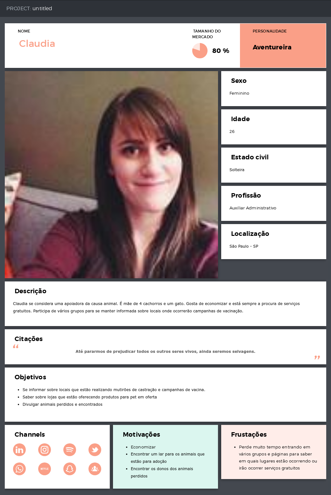
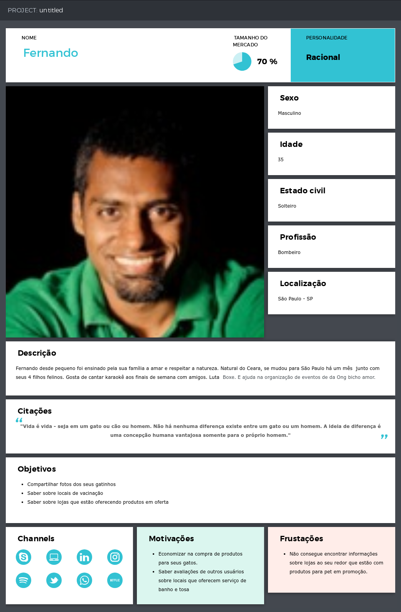
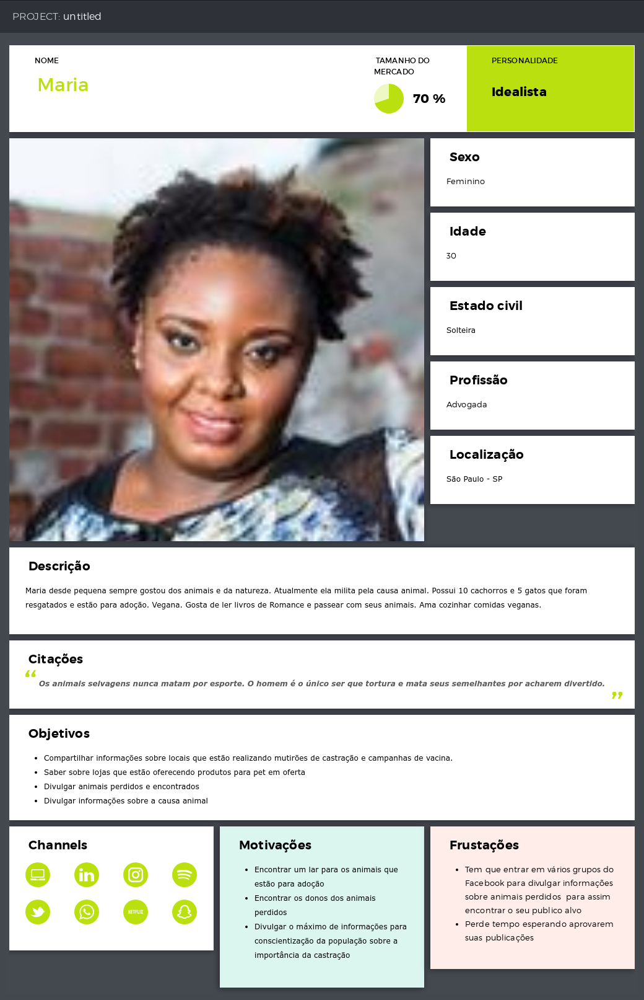

#Love Pets

## Índice

* [Preâmbulo](#preâmbulo)
* [Definição do produto](#definição_do_produto)
* [Público alvo](#público_alvo)
* [Testes de Usabilidade](#testes_de_usabilidade)
* [Protótipos](#protótipos)

## Preâmbulo

Redes sociais são uma forma muito importante de conexão entre pessoas no século XXI. Através delas, usuários lêem notícias sobre o mundo, encontram eventos interessantes para o seu perfil, conversam com familiares e amigos distantes, entre outros.
Não apenas importantes para a interação social e informação, as redes sociais funcionam como uma forma de reunir desconhecidos com interesses em comum, que foi o objetivo focado em nosto projeto.

## Definição_do_produto

Nossa rede social foi desenvolvida para ser mobile first e é focada em usuários que amem animais, seja o dono de um cachorrinho até o defensor das causas animais de forma ativa. 
Devido ao tempo disponível, não foi possível implementar todas as funcionalidades desejadas, como por exemplo a de adicionar amigos, mas o objetivo é que ela funcione unindo essas pessoas com o amor pelos animais em comum, permitindo que ela postem informações de lazer, como o dia a dia do seu animalzinho de estimação, até notícias, como novas leis de proteção dos animais aprovadas, eventos de vacinação e castração coletivos ou até poder registrar o calendário de vacinação do seu pet.
Em uma versão 2.0, todas essas funcionalidades seriam implementadas, mas no momento estão funcionais as ações de login, cadastro, postagem, filtro, exclusão e edição dos posts.

## Público_alvo

Quem são os principais usuários de seu produto?
	Amantes da causa animal que gostem de redes sociais para conhecer novas pessoas, seja apenas donos de pets até defensores ativos da causa.
Quais são os objetivos de seu usuário com relação ao seu produto?
	Postar novidades sobre seus animais e saber as novidades dos animais dos amigos e notícias sobre as causas animais postadas por outros.
Quais os dados mais importantes que eles querem ver em sua interface?
	Timeline com as postagens
Quando utilizam ou utilizariam seu produto?
    Quando quisessem conhecer novas pessoas apoiadoras da causa animal, para postar informações sobre seu pet para mostrar para seus amigos ou para saber informações postadas sobre a causa animal.

Personas

*1

*2

*3

		

## Testes_de_usabilidade

Entrevistas com os usuários utilizando o Protótipo Inicial Digital

* Aline Cherez - As funcionalidades estão claras
* Ana Paula - A tela de login está muito boa, a parte de menu também está bem funcional e clara.
* Alice - Está legal, simples, só não gostei muito da cor. Preferia uma cor mais clara.
* Aline Marjorie - Adorei tudo!
* Caissa Martins - Achei bem legal e gostaria que tivesse uma ferramenta para localizar pet shops próximos.
* Priscila Theodoro - Está muito bom, só acrescentaria a funcionalidade do link sair no protótipo.
* Camila Bastos - Consegui efetuar o login e postagem sem problemas.
* William Santos - O layout está bom, só estou duvidoso com a cor.
* Carla - Está bem intuitivo, fiz todo o fluxo sem ele me corrigir.

* Problemas detectados nos testes->

-Adicionamos ferramentas que usuários citaram como interessantes, apesar de não estarem funcionais ainda.

-Mudamos o esquema de cores e alguns intens de layout para facilitar visualização.

## Protótipos

*Protótipo Inicial Digital
[Link](https://marvelapp.com/project/3867485/)

*Protótipo Final Digital Figma
[Link](https://www.figma.com/file/Xcb5UMGFZmNWveJYF1mdXu3L/Love-Pets?node-id=0%3A1)

